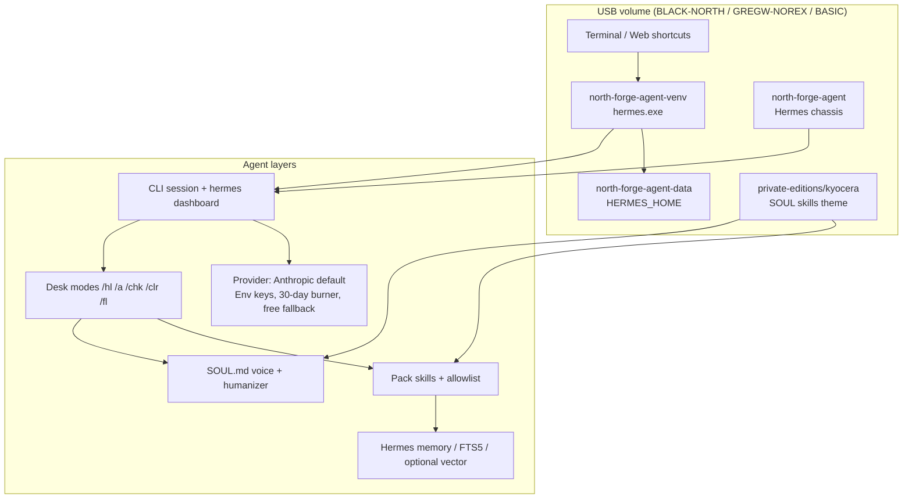
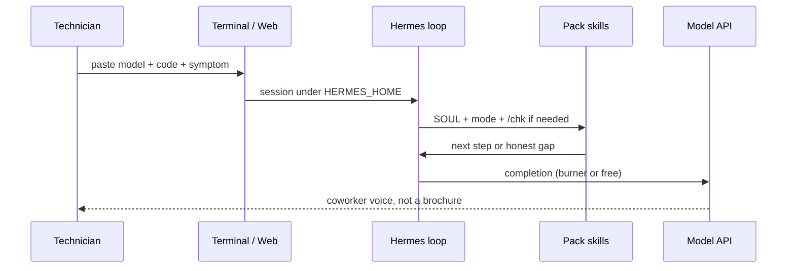

# Architecture (engineer, not a thesis)

Two systems. One desk. One optional lab. They do not share a process.

## Layer table

| Layer | What it is | Who owns it |
|---|---|---|
| Volume | Isolated venv + HERMES_HOME on the stick | Deploy Console |
| Chassis | Hermes Agent loop, tools, dashboard, models list | Nous / north-forge-agent fork |
| Pack | Kyocera well, SOUL, skills, theme, aliases | This private edition |
| Desk router | `/hl` `/a` `/chk` `/clr` `/fl` `/dash` | Pack skills |
| Inference | Anthropic first; dashboard can switch | Keys on the stick |
| Lab (optional) | Pinokio on another disk | User download, not fleet |

## Call path

## What is not in-process

Pinokio is a separate Electron app + `pinokio-home`. It does not load SOUL.
It does not write the Kyocera well. Screenshots and download links live in
`PINOKIO.md`. Install it on Windows, macOS, or Linux when you want a node
canvas. Do not copy it onto Greg.

Hermes official manual: https://hermes-agent.nousresearch.com/docs/
