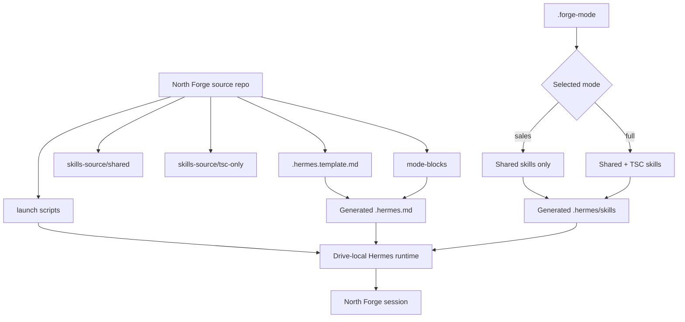

<div align="center">


```text
                         N
                         ▲
                         │
                    W ◄──┼──► E
                         │
                         ▼
                         S

          _   _  ___  ____ _____ _   _    _____ ___  ____   ____ _____
         | \ | |/ _ \|  _ \_   _| | | |  |  ___/ _ \|  _ \ / ___| ____|
         |  \| | | | | |_) || | | |_| |  | |_ | | | | |_) | |  _|  _|
         | |\  | |_| |  _ < | | |  _  |  |  _|| |_| |  _ <| |_| | |___
         |_| \_|\___/|_| \_\|_| |_| |_|  |_|   \___/|_| \_\\____|_____|

                         ╔═══════════════╗
                    _____║   NORTH FORGE ║_____
                   /     ╚═══════════════╝     \
                  /_____________________________\
                          \           /
                           \_________/
                              ||
                            __||__
                           /______\
```

# North Forge — Hermes Edition

### Field intelligence. Built locally. Forged for the work.

**Kyocera Edition v21.8**

A field-support AI for Kyocera Document Solutions technicians and sales reps — designed for KB authoring, hotline work, escalation packets, pre-sales guidance, and structured field support from a local PC or portable drive.

<br>

[](https://github.com/NousResearch/hermes-agent)


**Created and maintained by Kenneth C. Walker Jr. — Senior Technical Support Engineer, TSC**

</div>

---

> [!NOTE]
> **North Forge does not replace technician judgment.** It reduces the friction around routine calls, collects the minimum useful evidence, gives a direct next step, and says plainly when confidence is limited.

## ⚡ At a glance

| | |
|---|---|
| **Purpose** | Field-support AI content layer for Kyocera support and sales workflows |
| **Engine** | Hermes Agent by Nous Research |
| **Deployment** | Local PC or portable-drive workflow |
| **Primary modes** | `FULL` and `SALES` |
| **Content model** | One source tree → mode-specific generated runtime |
| **Auth / state** | Isolated per drive through `.hermes-home` |
| **Governance** | Private repo; sole-maintainer workflow |
| **Current release** | `v21.8` |

### What it is designed to do

- Draft structured KB content.
- Assist hotline and support-ticket intake.
- Build escalation packets.
- Support pre-sales product guidance.
- Route work into purpose-built Hermes skills.
- Keep FULL and SALES deployments synchronized from one source tree.
- Run from a portable drive without depending on the host machine's Hermes profile.

---

## 🧭 Navigate

[**Architecture**](#-architecture) ·
[**Skills**](#-skills-and-runtime-content) ·
[**Drive modes**](#-one-repo-one-toggle-two-drive-types) ·
[**Setup**](#-setting-up-a-new-drive-windows---the-one-canonical-path) ·
[**Launch**](#-one-click-launch-what-happens-after-provisioning-and-for-repeat-use) ·
[**Branding**](#branding) ·
[**Maintenance**](#-maintenance--updates) ·
[**Attribution**](#built-on-hermes-agent)

---

## 🏗 Architecture



The repository intentionally separates **engine**, **content**, **generated runtime**, and **per-drive state**. That separation is one of the main safeguards against configuration drift.

<details>
<summary><strong>Why this architecture exists</strong></summary>

North Forge's large master prompt exceeds the size that can safely live in a single Hermes context file. The always-loaded context therefore contains identity, routing, and universal rules, while detailed procedures live in skills that are loaded when needed.

The FULL / SALES split is also generated from one source tree. There is no separately maintained “sales edition” to drift out of sync.

</details>

---

## 🧰 Skills and runtime content

The tracked source of truth is:

```text
skills-source/
├── shared/
│   ├── sales-assist/
│   └── web-navigator/
└── tsc-only/
    ├── kb-builder/
    ├── draft-writer/
    ├── hotline-ticket/
    ├── assist-intake/
    ├── escalation-packet/
    ├── forge-audit/
    ├── fault-logging/
    └── training-guide/
```

> [!IMPORTANT]
> `.hermes/skills/` is generated at launch. **Never edit it directly.**

### FULL vs SALES

| Capability | SALES | FULL |
|---|:---:|:---:|
| Shared sales guidance | ✅ | ✅ |
| Web navigation | ✅ | ✅ |
| KB authoring | — | ✅ |
| Hotline / ticket workflows | — | ✅ |
| Escalation packet generation | — | ✅ |
| Audit workflow | — | ✅ |
| Fault logging | — | ✅ |
| Training guidance | — | ✅ |

---

## Built on Hermes Agent

This runs on top of [Hermes Agent](https://github.com/NousResearch/hermes-agent) by Nous Research (MIT licensed) - an open-source, general-purpose AI agent framework with real memory, scheduled background tasks, and a large tool/skill ecosystem. North Forge doesn't reimplement any of that; this repo is purely the *content layer* - the rules, the skills, the branding - that turns a general-purpose agent into this specific one. See `ATTRIBUTION.md` for the full license text and required notices.

**Want to add your own custom task or skill?** Hermes supports this natively, and it's worth knowing about beyond just this repo:

- **A one-off or recurring background task** (the pattern `kyocera-research` uses): from inside a live session, `/cron add "<schedule>" "<what to do>" --skill <optional-skill-name> --name <job-name>` - for example `/cron add "every 24h" "Check for new firmware release notes" --name nightly-firmware-check`. Check what's scheduled with `/cron list`.
- **A new skill of your own**: create a folder under `skills-source/shared/` (available in every mode) or `skills-source/tsc-only/` (FULL mode only) containing a `SKILL.md`. Give it YAML frontmatter with a `name:` field (this is what lets Hermes register it as a real `/slash-command` - without it, Hermes falls back to the folder name, which is usually not what you want) and a `description:` field, then write the actual instructions below a `---` closing line. The full Hermes documentation on skills, tools, and the wider ecosystem lives at the [Hermes Agent GitHub repo](https://github.com/NousResearch/hermes-agent) - worth a look if you want to go beyond what's built in here.


---

## Two-repo architecture

- **Engine:** `kwalker7631/north-forge-agent` - an untouched fork/mirror of NousResearch/hermes-agent. Never edited directly. Kept current with `gh repo sync` when Nous ships updates. This is a reference/audit copy only - it is not what the installed `hermes` command actually runs from (see below).
- **Content (this repo):** `kwalker7631/north-forge-hermes-edition` - North Forge's own material only: the always-loaded context file, the per-mode skills, and setup tooling. This is what gets built, versioned, and demoed.

A thumb drive deployment keeps its own Hermes engine and dependencies in `.hermes-home` beside this repository. The launchers deliberately set `HERMES_HOME` and `PATH` so a host-wide Hermes installation is neither used nor changed. A fresh install is built in `.hermes-install-staging`, validated, and only then promoted into place.


---

## Model choice matters - this is not Claude-only

North Forge's identity, tone, and rules in `.hermes.template.md` are written model-agnostic on purpose - "you are North Forge," never "you are Claude" or any other provider name. Hermes supports 30+ model providers via `hermes model`, and switching between them is intended and encouraged, not an edge case.

**Real constraint worth knowing before experimenting:** output quality depends heavily on which model is actually running underneath. A fast/cheap or lightweight model (e.g., a "flash"/"quick" tier model) will noticeably under-perform a frontier-tier model on North Forge's actual work - KB drafting, diagnostic reasoning, following the locked template correctly. This isn't a North Forge bug to fix; it's a property of the model chosen. When in doubt, prefer a stronger model over a faster one for anything going into a real KB or a real technician's hands. Track which models have actually been tried against North Forge and how they performed in `DEMO_PREP_BACKLOG.md`, so this stays evidence-based rather than assumed.


---

## Repo governance

This repo is private and not published. Kenneth Walker Jr. is the sole administrator - he is the only person who creates, edits, or commits content here. Team members who use a drive built from this repo never touch the repo itself; if someone has a suggestion or hits a problem, it's relayed to Kenneth (via a log, a description, or eventually the fault-logging skill once built) and handled through the Claude Project chat + Claude Code + Blacksmith review loop - never applied directly by whoever reported it.


---

## What's in here

```
.hermes.template.md          <- source template for the context file (tracked in git)
.hermes.md                   <- GENERATED at each launch from the template + mode - never edit directly, never committed
mode-blocks/
  full-banner.md              <- mode banner for FULL drives
  full-menu.md                <- command menu for FULL drives
  sales-banner.md             <- mode banner for SALES drives
  sales-menu.md                <- command menu for SALES drives
skills-source/                <- the real, tracked skill content (one copy, never duplicated)
  shared/
    sales-assist/SKILL.md     <- available in BOTH modes (built, but FAQ content is still a placeholder pending real spec-sheet curation)
    web-navigator/SKILL.md    <- available in BOTH modes (built, verified real links to kyoceradocumentsolutions.us)
  tsc-only/
    kb-builder/SKILL.md          <- full /kb procedure - FULL mode only
    draft-writer/SKILL.md        <- /draft procedure - FULL mode only
    hotline-ticket/SKILL.md      <- /hl, /ticket procedure - FULL mode only
    assist-intake/SKILL.md       <- /a, /assist procedure - FULL mode only
    escalation-packet/SKILL.md   <- /esc procedure - FULL mode only
    forge-audit/SKILL.md         <- /audit, /chk procedure - FULL mode only. CORRECTION (2026-08-29): earlier named forge-audit on a wrong assumption that "audit" collided with a reserved Hermes command name - it doesn't. The real cause of it being hidden from `hermes skills list` was Hermes's security scanner flagging the literal string "CLAUDE.md" that used to appear in the skill's own text (now reworded). The folder name was never the actual issue, but is kept as forge-audit rather than reverted. The user-facing command is still /audit or /chk.
    fault-logging/SKILL.md       <- /log, /fault, /report procedure - FULL mode only
    training-guide/SKILL.md      <- /train procedure - FULL mode only
    (all 8 tsc-only skills built - see NEXT_STEPS.md for authorship history)
.hermes/skills/                 <- GENERATED at each launch from skills-source/ - the exact folder name Hermes scans for project-local skills (see note below) - never edit directly, never committed
.forge-mode                    <- GENERATED per physical drive by toggle-mode - never committed, defaults to sales if absent
.agent-name                    <- OPTIONAL, one line of text, per physical drive - a custom nickname for the agent (e.g. "Kyle"). Never committed. Defaults to "North Forge" if absent. Create it by hand (a plain text file containing just the name) - no toggle script for this yet.
toggle-mode.bat / .sh          <- Kenneth-only: mode switch or fast onboarding/content RESET; preserves .hermes-home
full-drive-reset.bat / .sh     <- Kenneth-only: confirmed purge of this drive's engine and all Hermes state
machine-reset.bat               <- Kenneth-only: host-PC Hermes maintenance; always targets %%LOCALAPPDATA%%\hermes
skins/
  north-forge.yaml            <- Hermes skin: rebrands the CLI as "North Forge" using the KB visual palette
.env.example                   <- copy to .env, fill in your own Anthropic API key, never commit the real .env
.gitignore                     <- excludes secrets, per-drive mode, and generated files from version control
provision-new-drive.ps1        <- CANONICAL way to set up a new drive on Windows (see below) - drive-letter-agnostic, safe, one command
archive/
  setup-thumbdrive.ps1          <- SUPERSEDED, moved here from repo root - kept only because Kenneth's own personal drive was set up with it early on. Do not use for new drives.
launch-north-forge.bat         <- one-click Windows launcher: assembles the current mode, trusts the project skills, installs Hermes if missing, applies the skin, starts
launch-north-forge.sh          <- same, for Mac/Linux
KYO_KB_TITAN_v12_11_CONTACT_BLOCK_LOCKED.html  <- locked KB HTML template, required for /kb to produce a real draft
fallback/
  NORTH_FORGE_v21.8_PASTE_VERSION.md  <- complete, original single-file prompt - paste into any chat AI if this whole Hermes setup is ever unavailable
ATTRIBUTION.md                  <- required acknowledgment that this runs on the open-source Hermes Agent engine
USER_MANUAL.md                  <- plain-English end-user manual: every command, what skills are installed, how to add one, cheat sheet - written for the least technical person who ever gets handed a drive
research-log/
  kyocera-research-log.md       <- appended by the nightly-kyocera-research cron job (6 AM daily) - real, committed field-research findings, tracked in git on purpose
  daily-brief-log.md            <- appended by the daily-kyocera-brief cron job (8 AM daily) once it first runs
kb-images/                      <- intake/staging for actual image files techs provide during /kb work - one folder per KB number, _pending/ for pre-number images. Committed and shared across drives on purpose. Staging only: ServiceNow attach + manual placeholder replace stays manual, by design
FIRST_TIME_README.txt           <- plain-language quickstart for a first-time team member receiving a drive - not for Kenneth, for whoever gets handed one
CLAUDE.md                       <- Claude Code's working rules for this repo (Zone A/B/C authority model) - read by Claude Code automatically, not by Hermes itself
NEXT_STEPS.md                   <- what's built vs. still to build
DEMO_PREP_BACKLOG.md            <- running punch-list for demo prep, polish, and things flagged for later
CHANGELOG.md                     <- plain-language running history of what changed and why, distinct from git log and from the audit report below
logs/
  CLAUDE_CODE_LAST_AUDIT.md    <- most recent Claude Code session's audit report, overwritten each session
```

**Correction from an earlier version of this repo:** the generated skill folder used to be plain `skills/` at the repo root. That was wrong - confirmed by reading Hermes's actual installed source code, the real paths it scans for project-local skills are `.hermes/skills/` or `.agents/skills/`. Fixed everywhere in this version. Worth knowing this happened if you're demoing the debugging process, not just the fix - the folder name came from a third-party blog post that turned out to be inaccurate, and checking the real source code (not just documentation) is what actually resolved it.

## Project skills need to be trusted (a Hermes security feature, not a bug)

Separately from the folder-name issue: Hermes will not load skills from a project-local folder until you run `hermes skills trust` once - this stops a compromised `git pull` from silently injecting a malicious skill into a repo you already trusted. `launch-north-forge.bat`/`.sh` **auto-run this trust step on every launch**, trading a bit of that security model away for zero friction across the team - a deliberate choice, made because this repo is Blacksmith-reviewed before it ever reaches a drive. If that tradeoff ever stops feeling right (e.g. drives get built by more people than just Kenneth, or content starts coming from less-trusted sources), removing the auto-trust line and requiring `hermes skills trust` as a manual one-time step per machine is the safer default to fall back to.

## One repo, one toggle, two drive types

There is no separate "sales version" to maintain. Every skill is authored exactly once, in `skills-source/`, tagged `shared/` (both modes) or `tsc-only/` (FULL mode only). Every launch, the launcher deletes and rebuilds the live `.hermes/skills/` folder and the live `.hermes.md` from that source plus whichever `.forge-mode` says - so there's never a chance of the two "versions" drifting apart, because there's only ever one source.

`.forge-mode` is a one-word file (`full` or `sales`) that lives on each physical drive, is never committed to git, and is set once with `toggle-mode.bat`/`.sh` (Kenneth-only tooling, not something a rep needs). Missing the file at all defaults to `sales` - fails safe rather than fails open.

`toggle-mode.bat`/`.sh` also has a third option: **RESET**, a fast **onboarding/content reset** that removes eight first-use markers or generated-content targets: `.env`, `.forge-mode`, `.hermes.md`, `.drive-record.txt`, `.provider-choice`, `.agent-name`, `.readme-shown`, and `.hermes/skills/`. It explicitly preserves `.hermes-home`; Hermes credentials, memory, sessions, cron state, and other engine data therefore remain. The scripts verify marker removal and return an error if any target remains. Any confirmation other than uppercase `YES` leaves all eight intact. `forge-events.log` also remains, so RESET is not a complete privacy wipe.

For an unrecoverable drive cleanup, run **`full-drive-reset.bat`** on Windows or **`bash full-drive-reset.sh`** on macOS/Linux. This operation validates that its destination is exactly `<this repo>/.hermes-home`, refuses roots, parents, shared folders, and symbolic links, then displays the full path. You must type that complete path—not `YES`. It ties the gateway commands to the validated drive folder and removes the folder only if both commands succeed. Help: the displayed path is the only accepted answer. Tip: press **Ctrl+C** to cancel before deletion.

On a Sales-mode drive, the TSC-only skill files are never copied into the live `.hermes/skills/` folder at all - not hidden, not disabled by a prompt instruction alone, physically absent from that session. The `.hermes.md` generated for that mode also tells the model plainly to redirect any support/repair/KB request to the normal TSC channel rather than attempt it from general knowledge.

## Custom agent name (optional, per drive)

By default the agent identifies itself as "North Forge." To give a specific drive a personal nickname instead (useful for demos to people who aren't already comfortable with AI - "call it Kyle" reframes it as "my assistant" rather than "a chatbot"), create a file named `.agent-name` in the repo root containing just the name, one line, nothing else. Missing the file at all defaults to "North Forge."

The name is a cosmetic layer only - every rule and behavior in `.hermes.template.md` and every skill still applies exactly as written regardless of what the agent calls itself. This currently only changes how the model refers to itself in conversation; the CLI's own visible banner/label still says "North Forge" regardless (a further enhancement, not yet built - see `DEMO_PREP_BACKLOG.md`).

There's no toggle script for this yet (unlike `.forge-mode`) - create/edit the file by hand for now.

## Branding

The CLI is rebranded via a Hermes **skin** (`skins/north-forge.yaml`) - agent name, welcome text, and colors change to "North Forge" using the same palette already defined in the KB visual standard (Kyocera red, technical blue, confirmed-path green). Skins only affect appearance, not behavior - the underlying engine is still Hermes Agent, MIT-licensed, and that's acknowledged in `ATTRIBUTION.md`. Nous Research is not affiliated with or endorsing this deployment.

## Fallback: standalone paste-in version

`fallback/NORTH_FORGE_v21.8_PASTE_VERSION.md` is the complete, original, unsplit v21.8 master prompt - the same one used before the Hermes adaptation. If the drive, the engine, or the skill-loading mechanism is ever unavailable, copy that file's content into any chat AI (Claude, ChatGPT, Gemini, whatever's on hand) as a last resort - no setup required, works standalone. It is not auto-generated from `.hermes.template.md` and `skills-source/`, so keep it updated manually when the master prompt changes.

## Setting up a new drive (Windows) - the one canonical path

North Forge is designed to run from the root of a USB drive or other
portable/remote storage device, but it will work from the root of any
drive - a laptop's internal drive, a network share, anywhere. Installing
at a drive's root keeps it self-contained and makes it available to
anyone who plugs in or mounts that drive, without needing anything
pre-installed on the host machine beyond what the drive itself checks
for at first launch.

`provision-new-drive.ps1` is the only recommended way to set up a new drive. It is drive-letter-agnostic (does NOT assume D:, E:, or any specific letter - it lists the drives actually present and auto-picks if there's only one), hard-refuses to ever touch the system (`C:`) drive no matter how it's selected, and refuses to proceed on a FAT32-formatted drive (4GB file-size cap, real problems here) - exFAT or NTFS only. It installs Git if missing, clones (or pulls, if already cloned), and launches - one command, nothing else to run first.

```powershell
.\provision-new-drive.ps1
```

No GitHub CLI (`gh`), no `gh auth login`, no browser sign-in step for whoever runs this - the script clones using a read-only access token that's already embedded in the file (see below for how that got there). It only prompts when there's real ambiguity (more than one non-system drive present), and never asks for anything that could be mistyped into damaging the machine.

`archive/setup-thumbdrive.ps1` is superseded by this script and kept only for historical reasons - don't use it for new drives.

## One-click launch (what happens after provisioning, and for repeat use)

`launch-north-forge.bat` (Windows) and `launch-north-forge.sh` (Mac/Linux) live in the repo root. Each launcher distinguishes a missing, valid, or incomplete drive-local `.hermes-home`; installs and validates the drive's independent copy when absent; then configures the provider, applies the skin, and starts North Forge. A failed install leaves details in `install-logs` and requires the operator to remove or rename the clearly identified partial folders before retrying.

**One real caveat on Mac/Linux:** exFAT (needed for a drive that works across Windows/Mac/Linux) can't store the Unix "executable" permission bit, and macOS doesn't auto-run anything on drive insert (Apple removed that years ago for security). So the very first time on any given Mac needs one manual step - after that, it's a real double-click icon every time.

**On a Mac, the very first time only (once per Mac, ever):**
1. Plug in the drive.
2. Open Terminal: press Cmd+Space, type `Terminal`, press Enter.
3. Type `bash ` (the word bash, then a space) - do not press Enter yet.
4. Open the drive's Finder window, find `launch-north-forge.sh`, and drag that file into the Terminal window. This fills in the correct full path automatically - do not type the path by hand.
5. Press Enter.

That single run installs Hermes if needed, sets up `.env`, and - important - creates a **"North Forge" icon on that Mac's Desktop**. From then on, that person double-clicks the Desktop icon like any normal app. They never touch Terminal again on that machine.

(This assumes the drive keeps the same volume name each time it's plugged in - macOS mounts by name, so renaming the drive after setup would need the one-time step redone.)

On Linux, the same drag-and-drop-into-terminal trick works, or `bash launch-north-forge.sh` typed directly if terminal is already comfortable. Requires `python3` on PATH - the script checks for this and gives a clear error with an install hint if it's missing, rather than failing with a raw error partway through.

Windows doesn't have any of this trouble - `.bat` files run by file extension, not permission bit, so double-click works there from the first plug-in.

`KYO_KB_TITAN_v12_11_CONTACT_BLOCK_LOCKED.html` (the locked KB template) is checked in at the repo root - required before `/kb` can produce a publishable draft.

## Why the content is split into skills instead of one big file

Hermes truncates context files over 20,000 characters (drops the middle silently). The full North Forge master prompt is well past that. Rather than lose rule blocks with no error, the always-loaded `.hermes.md` carries only identity/persona/routing/universal rules, and each mode's detailed procedure lives in its own skill file that Hermes reads on demand when that mode triggers.

## Skills are locked, not self-improving

Hermes skills normally refine themselves through use. North Forge's skills are the exception - see the `hermes_specific_addendum` section in `.hermes.md`. Nothing in `skills-source/` gets auto-edited. Changes go through the Blacksmith (Kenneth Walker Jr.).

## 🔧 Maintenance & updates

### Updating Hermes on a drive (not this repo)

Each physical drive has its own Hermes engine and setup choices under `<repo>/.hermes-home`. Launch that drive first, then run `hermes update` from its North Forge window to update that drive's engine. After an update, run `hermes doctor`, `hermes skin list`, and `hermes skills list --source local`, then do one real launch in each mode before trusting it.

**Where Hermes state lives:** each North Forge drive forces Hermes to use its own `.hermes-home` folder at the repository root. This keeps that drive's `config.yaml`, skin, memory/sessions, and `cron/` jobs separate from every other North Forge drive and from the computer's shared Hermes profile. The folder is on the drive but is ignored by Git; do not commit it.

To reset a drive's North Forge choices, use `toggle-mode.bat` or `.sh` and select **RESET** as described above. Do not delete a computer's shared Hermes folders to reset a North Forge drive.

<details>
<summary><strong>🔐 Maintainer-only GitHub administration</strong></summary>

### Kenneth's own GitHub CLI setup (repo administration - NOT needed to provision a drive)

Nothing below this point is needed by a team member setting up a drive - `provision-new-drive.ps1` handles that with no `gh` dependency at all. This section is for Kenneth's own administrative tasks: creating the read-only access token that gets embedded in `provision-new-drive.ps1`, managing repo settings, syncing the engine fork, and similar `gh`-driven tasks.

**1. Use PowerShell, not Git Bash** for these commands specifically - Git Bash can run some of it, but paths and `.bat` files behave differently there and it's not worth the translation.

**2. Check git is installed:**
```powershell
git --version
```
If that errors, install Git for Windows first (https://git-scm.com/download/win).

**3. Check GitHub CLI (`gh`) is installed:**
```powershell
gh auth status
```
If you get `'gh' is not recognized...`, install it:
```powershell
winget install --id GitHub.cli
```
Then close this PowerShell window completely and open a brand new one - this matters, PowerShell won't see the new `gh` command in the same window it was installed from.

**4. Log in:**
```powershell
gh auth login
```
Answer the prompts: **GitHub.com** -> **HTTPS** -> **Yes** (authenticate Git with GitHub credentials) -> **Login with a web browser**. It gives you a one-time code and opens your browser - paste the code, approve it, come back.

**5. Confirm:**
```powershell
gh auth status
```
You're looking for a line confirming you're logged in to github.com. Once you see that, `gh` is ready for repo administration tasks - `gh repo view`, `gh repo sync` on the engine fork, and so on.

**Generating the read-only token that goes in `provision-new-drive.ps1`:** go to `github.com/settings/personal-access-tokens/new`, scope it to this one repository only, set Repository permissions -> Contents: Read-only (nothing else needed), generate it, and paste it into the line that sets `$cloneUrl` near the top of `provision-new-drive.ps1`, replacing `YOUR_TOKEN_HERE`. This is a one-time edit before handing a drive to anyone - the script itself refuses to run with a clear message if that placeholder is still there, so a team member should never see it.


</details>

---

<div align="center">

### 🔥 North Forge

**Guidance in the field. Discipline in the build.**

`Hermes-powered` · `Portable` · `Mode-aware` · `Private` · `Field-focused`

<sub>
North Forge — Hermes Edition · Kyocera Edition v21.8<br>
Created and maintained by Kenneth C. Walker Jr.
</sub>

</div>
