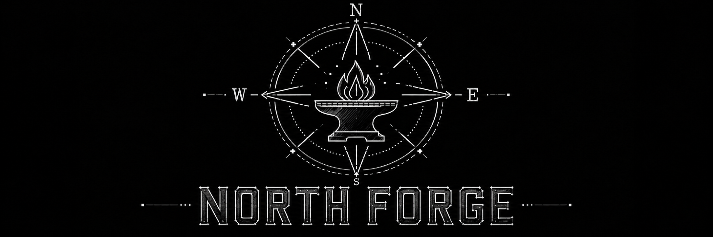

# North Forge — Kyocera Edition

<div align="center">


# Private TSC pack

Same chassis as the public build. This repository is the manufacturer pack —
procedures, skills, and deploy tools that do not belong on a public page.

<br>

[](CURRENT.md)
[](distribution.yaml)
[](#)
[](#)
[](CURRENT.md)

**Version:** `distribution.yaml` v0.1.0 · **Maintained by:** Kenneth C. Walker Jr.  
**Access:** private. Teammates receive a stick, not this repository.

</div>

---

> [!NOTE]
> North Forge does not replace technician judgment. It reduces friction on routine calls, collects the minimum useful evidence, gives a direct next step, and says plainly when the pack does not have the page.

| Start here | Purpose |
|---|---|
| **[CURRENT.md](CURRENT.md)** | Current architecture and skill catalog |
| **[Advanced/deploy-console/DEPLOY.md](Advanced/deploy-console/DEPLOY.md)** | Build a stick without typing Git |
| **[LEARNING.md](LEARNING.md)** | How the pack gets less wrong over time |
| **`/readme kyocera`** | In-session pointer to this set |

Public chassis: [kwalker7631/north-forge-agent](https://github.com/kwalker7631/north-forge-agent) · `/readme north-forge-agent`

---

## What you hand a teammate

1. Plug the stick in.
2. Double-click **Start North Forge**.
3. Describe the device and the problem in ordinary English.
4. If they get lost, they type `/menu`.

Volume name is **FIRSTL-NORTH** (Greg Warhol → `GREGW-NORTH`). Agent name is optional. Default is North Forge.

They do not need Git, GitHub, or a password. If the stick fails, they hand it back. They do not format it.

---

## Scope

Print, scan, finish, paper path, supplies. The PC and network the device sits on (Windows, macOS, Linux). PaperCut, MyQ, and the other document tools the skills know. Hotline, KB draft, escalation, fault log, new-hire training.

When a procedure exists, the next step should be exact. When it does not, the pack should stop and keep the answer after someone supplies it.

Live fault walkthroughs belong in skills — not on this front door.

---

## Architecture

As of 11 September 2026 this repository is a **profile pack**. It installs into a public North Forge checkout. It is not a standalone product with a FULL/SALES toggle or its own `.hermes-home`.

Retired launchers remain under `archive/legacy-standalone-launcher/`. Do not use them for a new stick.

```
USB
  Start North Forge.lnk
  HOW_TO_START.txt
  north-forge-agent/                 public chassis
    private-editions/kyocera/        this repository
  north-forge-agent-venv/
  north-forge-agent-data/            HERMES_HOME + admin hash
```

Admin builds the stick from **Advanced/deploy-console/** on a PC that has completed `gh auth login` once.

---

## Skills

| Skill | Command | Job |
|---|---|---|
| menu | `/menu` | Front door |
| readme | `/readme` | This documentation set |
| assist-intake | `/a` `/assist` | Structured intake |
| hotline-ticket | `/hl` `/ticket` | Ticket packet |
| kb-builder | `/kb` | KB draft to the locked template |
| draft-writer | `/draft` | Short draft |
| escalation-packet | `/esc` | Escalation with evidence on hand |
| fault-logging | `/log` `/fault` | Durable fault record |
| forge-audit | `/audit` `/chk` | Check a draft against the rules |
| training-guide | `/train` | Teach a new tech the workflow |
| sales-assist | sales prompts | Pre-sales |
| web-navigator | vendor hops | Official public pages only |
| kyocera-research | research / cron | Public release-note watch |
| daily-brief | brief | Morning digest |

A later Sharp, Ricoh, or Xerox edition is this table with different portals.

---

## Admin — install by hand

Use only if you are not using the deploy console.

```
git clone git@github.com:kwalker7631/north-forge-hermes-edition.git private-editions/kyocera
```

From the public checkout:

```
scripts\nf-setup.ps1 -Tier basic -Pin kyocera -Installed kyocera
```

Use `-Tier full` only on an admin stick that should switch projects. Set the passcode with `scripts\nf-setup.ps1 -SetPasscode` on the engine side. Store the hash only.

Update later: `hermes profile update kyocera`

If a stick looks wrong, run `scripts\nf-setup.ps1 -Show` and `scripts\nf-preflight.ps1` in the **engine** repository.

---

## Governance

Kenneth C. Walker Jr. is the only person who commits here. Teammates do not touch Git. Suggestions come back as a note or a fault log.

---

## Thanks

The runtime under the public checkout is [Hermes Agent](https://github.com/NousResearch/hermes-agent) by Nous Research and contributors (MIT). Thank you. It is not what you pitch first.
